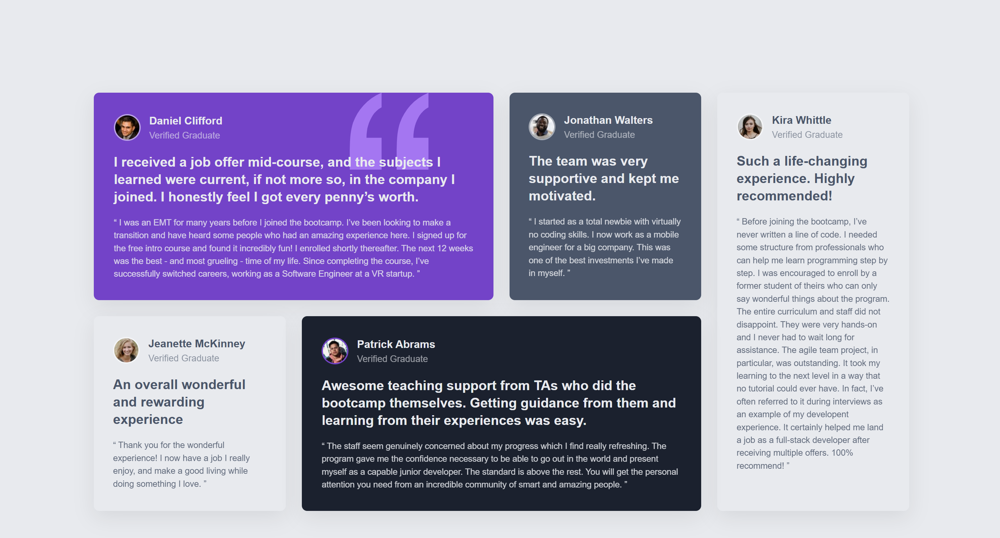

# Frontend Mentor - Testimonials grid section solution

This is a solution to the [Testimonials grid section challenge on Frontend Mentor](https://www.frontendmentor.io/challenges/testimonials-grid-section-Nnw6J7Un7). Frontend Mentor challenges help you improve your coding skills by building realistic projects. 

## Table of contents

- [Overview](#overview)
  - [The challenge](#the-challenge)
  - [Screenshot](#screenshot)
  - [Links](#links)
- [My process](#my-process)
  - [Built with](#built-with)
  - [What I learned](#what-i-learned)
  - [Continued development](#continued-development)
- [Author](#author)

## Overview

### The challenge

Users should be able to:

- View the optimal layout for the site depending on their device's screen size

### Screenshot

A responsive grid-based layout displaying multiple testimonial cards.  
Each card highlights a graduate’s experience, with individual color themes and grid positioning that follow the original Frontend Mentor design.

The goal of the challenge was to **recreate the design faithfully** while keeping the structure semantic, maintaining good readability, and practicing modern layout techniques with **CSS Grid** and **Sass**.

---

### Links

- **Solution URL:** [https://www.frontendmentor.io/solutions/testimonial-grid-section-using-css-grid-and-sass-W0dQDAK0Lc](https://www.frontendmentor.io/solutions/testimonial-grid-section-using-css-grid-and-sass-W0dQDAK0Lc)  
- **Live Site URL:** [https://edoardozampini.github.io/testimonial-grid-section/](https://edoardozampini.github.io/testimonial-grid-section/)

---

## My process

### Built with

- Semantic **HTML5** markup  
- **CSS Grid** for complex layout  
- **Flexbox** for local alignment inside cards  
- **Sass (SCSS)** for modular, maintainable styling  
- **BEM naming convention** for class organization  
- **Mobile-first workflow**  

I started by analyzing the layout structure from the design, identifying the main grid template and how each card should span across rows and columns.  
Then, I defined reusable Sass partials for variables (colors, typography, spacing) and base styles, allowing for a cleaner and more scalable stylesheet.

Once the base grid was in place, I adjusted card colors, typography, and spacing to match the provided reference.

---

### What I learned

I'm proud of how I managed to structure the layout using **CSS Grid** — it was a bit challenging at first, since I’m still more comfortable with **Flexbox**, but I now have a better understanding of how to position and span elements precisely across the grid.  

Key takeaways:
- Setting up multi-row and multi-column layouts using `grid-template-areas` and `grid-column` / `grid-row`.  
- Organizing styles in **Sass partials** for better maintainability.  
- Using **BEM** to keep the HTML and CSS consistent and readable.  

Example of the grid setup:

.testimonials {
  display: grid;
  grid-template-columns: repeat(auto-fit, minmax(250px, 1fr));
  gap: 1.5rem;
}

### Continued development

In future projects, I’d like to:

- Deepen my understanding of advanced CSS Grid layouts (auto-placement, alignment, and nested grids).
- Experiment with Sass mixins and functions to automate repetitive styles.
- Focus more on accessibility and color contrast consistency.

## Author

- Website: [Schima](https://schima.it/)
- Frontend Mentor: https://www.frontendmentor.io/profile/edoardozampini
- GitHub: https://github.com/edoardozampini